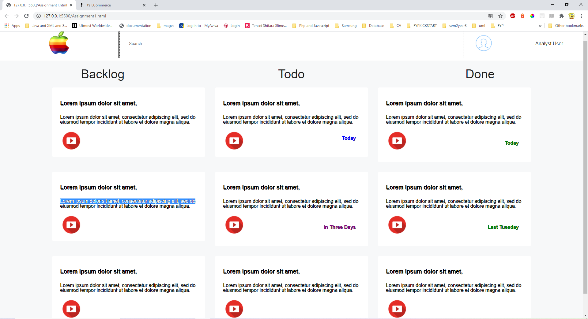
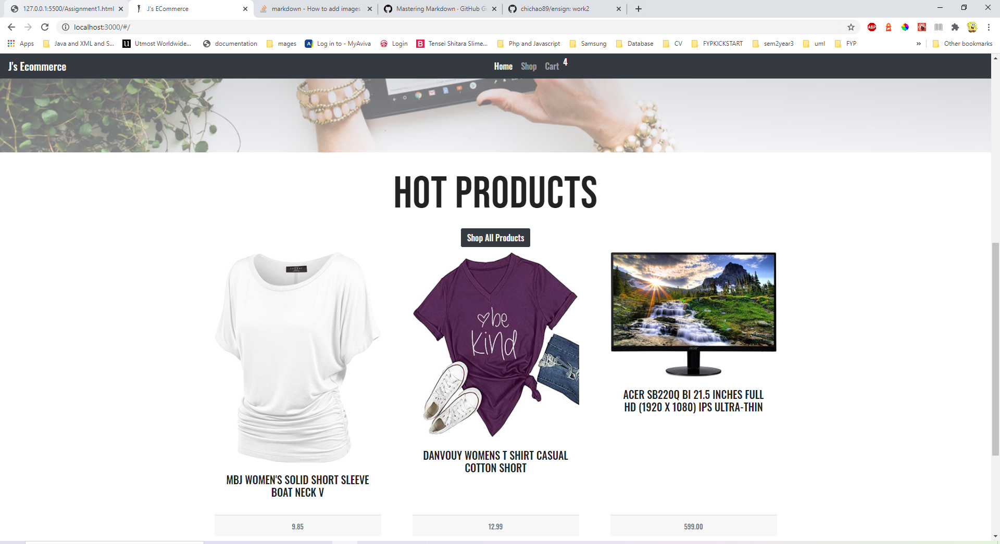
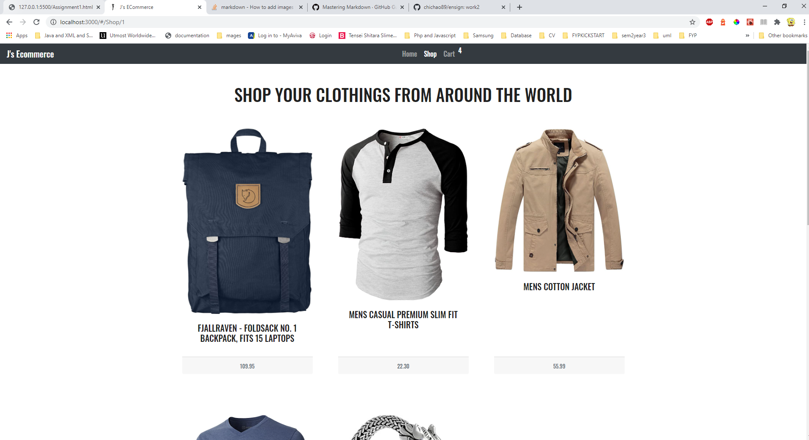
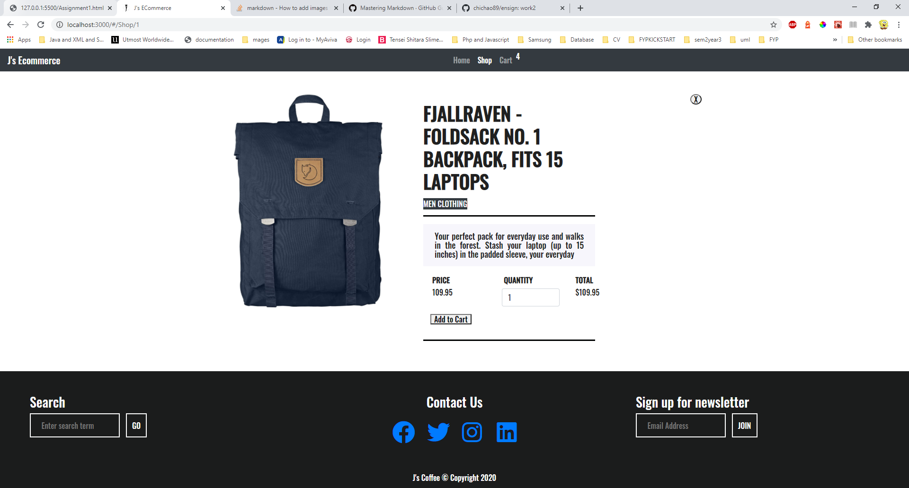
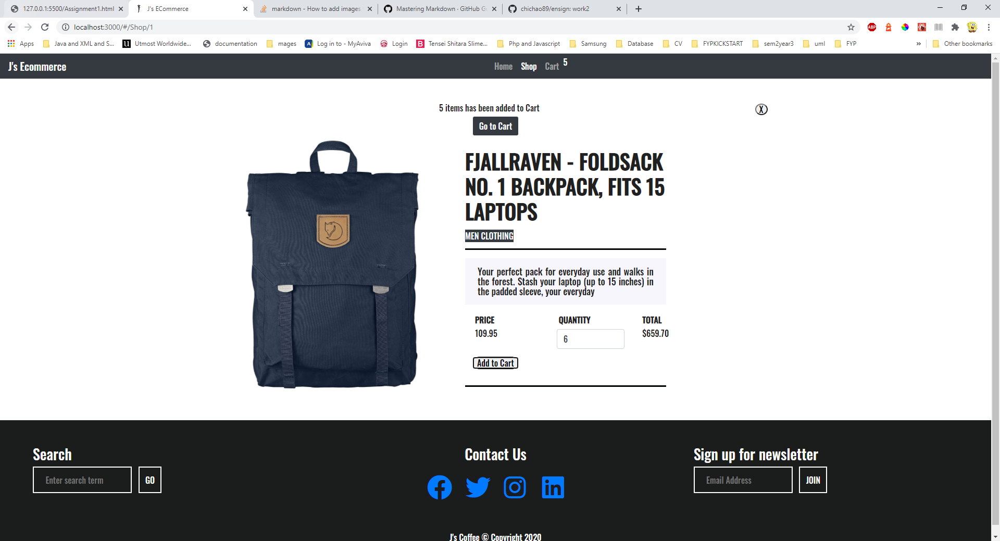
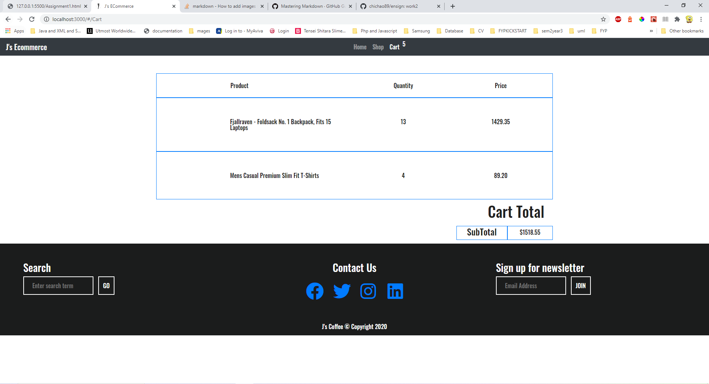

# ensign
 #Assignment 1
-Design 
Assumptions - I have based on what i understand about components and tried to replicate as similar as closely as I could. The contents are hardcoded and the images are refer from internet address links for simplicity purposes.
1. I have created with a format that is meant to be responsive friendly. There will be a container, followed by a header section and the card sections.  The css will be targeted into this 3 different components and the idea is to only try to reuse as much classes as possible.
2. For the header component, i had try to divide the whole header into 3 cols to adjust accordingly. 
3. After the header component, i created another row and divide the cols into equal widths for the headings
4. For the card component , there is a card component created by grid template cols and it will be auto fit based on the pixels provided. The idea is to make it have easily usable and nice to see with the color and simple icons.
Please find the css,html and the working image shown.

#Assignment 2
1. git clone the github repository
2. do npm install 
3. npm start 
4. Website should run on local host.
6. Assumptions - Use React Bootstrap for the design and layout with scss used to customize any styling or bootstrap features
7. Home, Jumbotron, Navigation, Footer, ECommerce, Cart,Shop are the different components used in this project.
8. The pages are routed via routing to serve the different components
9. I have Used composition concept to pass the state for the ECommerce Component to ECommerce Details and Home Page.
10. ECommerce Details page has a toggle switch to close and open to go back to the ECommerce products.
11. Validation errors and some bugs were not handled due to time contraints.
12. There is a bug inside add to cart where it is not able to detect the number of items correctly in the cart, there may be 2 cart items but cart will show 5, it is due to the the item object being created each time while being 14.added in the application storage. However it is able to detect different cart items and show the total amount and qty correctly. 
13. The storage is via the local storage session so there is some peristance in the form of data stored however deletion needs to be handled after some time.
14. The API is called via the fakeapistore to retrieve the number of items.
15. There is also a button to load more items if needed.
16. For state management, i have tried to use props and to pass them from components to component data. 

------------------------------------------

-------------------------------------------

-------------------------------------------------------

-------------------------------------------------------

